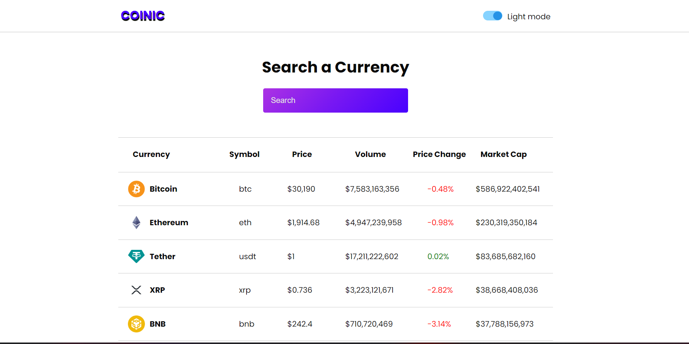

# Crypto App



A crypto app built with React and CSS, utilizing a crypto API to display different cryptocurrencies with their symbols, price change, volume, and price. The app also includes a search bar that enables users to search and filter any cryptocurrency.

## Features

- Display of cryptocurrencies with their symbols, price change, volume, and price.
- Utilization of a crypto API to fetch cryptocurrency data.
- Search bar functionality to search and filter cryptocurrencies.

## Technologies Used

- React: A JavaScript library for building user interfaces.
- CSS: Cascading Style Sheets for styling the app.
- Crypto API: An external API used to fetch cryptocurrency data.

## Installation

To run the Crypto App locally, follow these steps:

1. Clone the repository:

   ```shell
   git clone https://github.com/your-username/crypto-app.git
   ```

2. Navigate to the project's directory:

   ```shell
   cd crypto-app
   ```

3. Install the dependencies:

   ```shell
   npm install
   ```

4. Start the application:

   ```shell
   npm start
   ```

5. The app will be running at http://localhost:3000.

## Usage

Once the Crypto App is up and running, you can use it to view and search different cryptocurrencies. The app will display information such as the cryptocurrency symbol, price change, volume, and price. Utilize the search bar to filter cryptocurrencies based on your search query.

## Contribution

Contributions to the Crypto App are welcome! If you would like to contribute, please fork the repository and submit a pull request with your changes.

## License

The Crypto App is licensed under the MIT License. See [LICENSE](LICENSE) for more information.

## Conclusion

Congratulations! You have successfully installed the Crypto App locally and learned about its features. Feel free to explore the app, search for cryptocurrencies, and customize it according to your needs. If you have any questions or encounter any issues, please refer to the project's documentation or seek assistance from the project maintainers. Enjoy using the Crypto App to track and explore cryptocurrencies!
